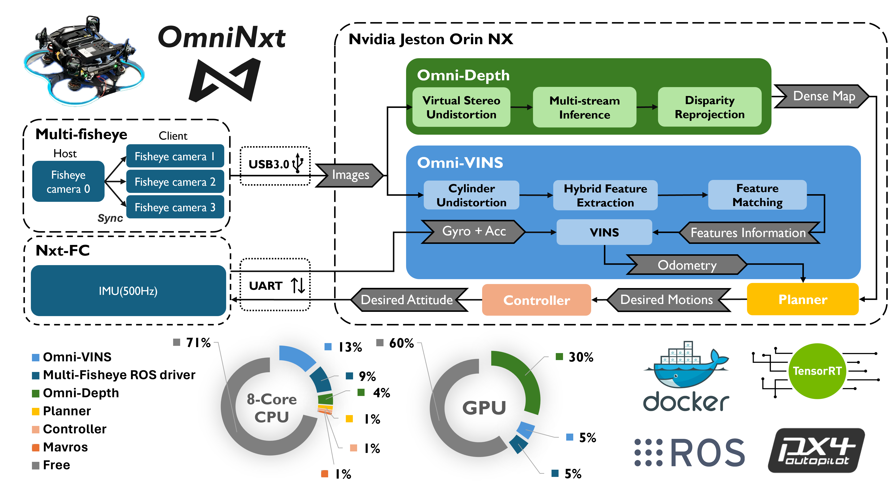

    <h2>OmniNxt: A Fully Open-source and Compact Aerial Robot with Omnidirectional Visual Perception</h2>
    <strong>Submitted to IROS 2024</strong>
     
        <a href="https://uav.hkust.edu.hk/current-members/" target="_blank">Peize Liu</a>,
        <a href="https://chen-albert-feng.github.io/AlbertFeng.github.io/" target="_blank">Chen Feng</a>†,
        <a href="" target="_blank">Yang Xu</a>,
        <a href="" target="_blank">Yan Ning</a>,
        <a href="https://www.xuhao1.me/" target="_blank">Hao Xu</a>†, and
        <a href="https://uav.hkust.edu.hk/group/" target="_blank">Shaojie Shen</a>
    

        <h45>
            HKUST Aerial Robotics Group &nbsp;&nbsp;
             
        </h5>
        †Corresponding Authors
    

    
    
    
    <!--  -->

  

Coming soon ~~~~
